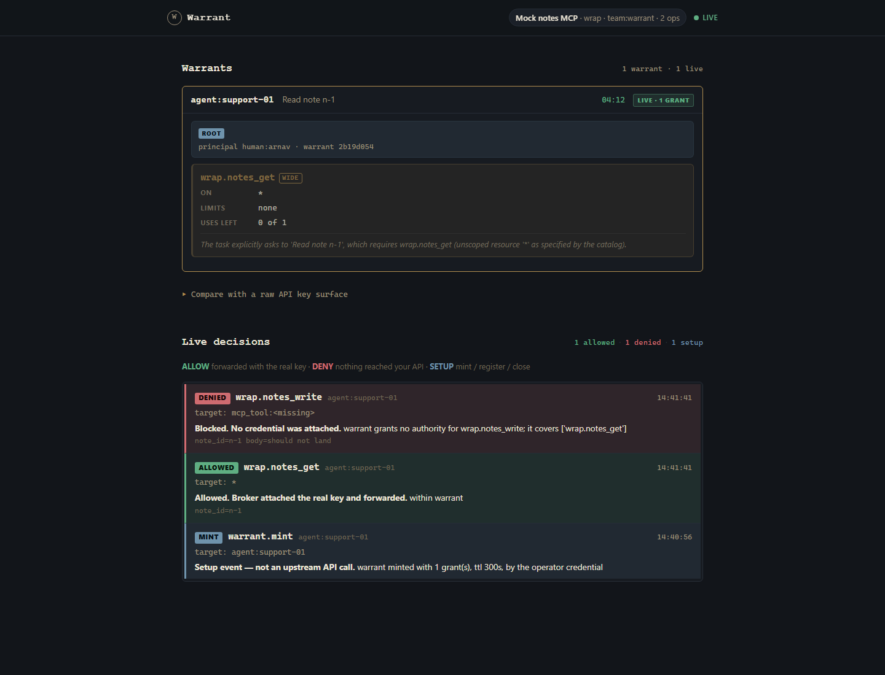

# Warrant

### Prompt injection isn't a model problem. It's an authority problem.

Agents don't get credentials. They get **warrants** — authority derived from what they said they'd do, enforced at the wire, expiring in minutes.

**Connect Warrant under the MCP tools you already use.** The agent keeps working. Real keys stay in the broker / wrap process. Authority is whatever the task said — for minutes.

```text
Cursor / Claude  →  Warrant MCP  →  broker checks warrant  →  your upstream MCP (or HTTP API)
```

---

## Front door: wrap an MCP in ~10 minutes

Most agent tools today are already MCP servers holding a fat service account. Warrant sits in front: sync their tools into the catalog, mint a task-scoped warrant, connect Cursor to Warrant (not straight to the upstream).

### 1. Install

```bash
cd warrant
python -m venv .venv && .venv/Scripts/pip install -r requirements.txt
# set GEMINI_API_KEY (or put it in a gitignored .env)
# optional: WARRANT_LLM_MODEL=gemini-flash-latest
```

### 2. Broker only, then sync

```bash
python -m demo.stack up --profile wrap
# broker :8100 — empty catalog until you sync

python -m mcp_server.sync --config examples/wrap_mock.json
# registers wrap.notes_get, wrap.notes_write from the sample upstream MCP
```

Point `examples/wrap_mock.json` (or a copy) at **your** MCP: `command`, `args`, `env`, optional `cwd`. Sync again. Those tools become catalog ops Warrant can grant and enforce.

### 3. Mint a warrant from the task

```bash
python -m demo.operator --task "Read note n-1" --quiet
# → prints WARRANT_TOKEN  (TTL is short — remint when it expires)
```

Out-of-scope calls (e.g. writing a note, reading a different resource if grants are tight) die at the broker and **never reach** the upstream MCP.

### 4. Connect Cursor to Warrant

Use [`run_mcp.py`](run_mcp.py) so Cursor does not need the warrant repo as cwd. In `%USERPROFILE%\.cursor\mcp.json` (paths absolute):

```json
{
  "mcpServers": {
    "warrant": {
      "command": "C:/path/to/warrant/.venv/Scripts/python.exe",
      "args": ["C:/path/to/warrant/run_mcp.py"],
      "env": {
        "PYTHONPATH": "C:/path/to/warrant",
        "WARRANT_BROKER_URL": "http://127.0.0.1:8100",
        "WARRANT_WRAP_CONFIG": "C:/path/to/warrant/examples/wrap_mock.json",
        "WARRANT_TOKEN": "<token from demo.operator>"
      }
    }
  }
}
```

Reload the MCP server in Cursor. You should see the wrapped tools; denials show up in the live console at `http://127.0.0.1:8100/console`.

**Why this is the product path:** you did not adopt a fake IT desk. You put a warrant under tools you (or your team) already run.

### What that looks like in the console

Same wrap flow as above, against the mock notes MCP: task was **Read note n-1**. The warrant grants only `wrap.notes_get`. A read is allowed; a write is denied before anything reaches the upstream MCP.



Open `http://127.0.0.1:8100/console` while Cursor (or any MCP client) calls tools — the warrant roster and live decisions update as each call is checked.

---

## Also: your own HTTP APIs

If you expose REST instead of MCP, declare ops in a JSON manifest, boot with that catalog, mint, connect Warrant MCP in **catalog mode** (omit `WARRANT_WRAP_CONFIG`). Knobs:

| Knob | Meaning |
|---|---|
| Manifest / `POST /catalog/register` | Declares ops — derivation, enforcement, MCP tools, UI update |
| `WARRANT_MANIFESTS` | Path(s) loaded at broker boot (`os.pathsep`-separated) |
| `WARRANT_BUILTINS=0` | No commerce sample catalog |
| `WARRANT_CREDENTIAL_<SERVICE>` | Per-service bearer the broker attaches on ALLOW |
| `UPSTREAM_KEY` | Shared fallback credential when per-service env unset |

Sample HTTP manifest (not the product identity): [`examples/it_helpdesk.json`](examples/it_helpdesk.json)

```bash
python -m demo.stack up --profile helpdesk
python -m demo.operator --task "…" --quiet
# Cursor: same run_mcp.py config, without WARRANT_WRAP_CONFIG
```

Credentials stay in the broker. MCP / agent hold only `WARRANT_TOKEN`.

---

## The mechanism

```text
task statement ──► derive (Gemini) ──► warrant (signed, scoped, TTL)
                                            │
agent / MCP (no keys) ──X-Warrant──► BROKER ──check──► DENY 403
                                            └── allow ──► + credential / forward ──► upstream
                                                                 │
                                                              audit
```

1. Human states the task.
2. Gemini derives the **minimum** authority that task needs.
3. That becomes a signed, short-lived warrant.
4. Every call goes through the broker (HTTP `/call` or MCP tool → `/call`).
5. Match → attach credential or authorize-and-forward. No match → 403.
6. Full attribution audit: who, which agent, which task, allow/deny and why.

Minting requires `OPERATOR_KEY`. Calling does not. The agent/MCP process must not have `OPERATOR_KEY` or upstream credentials — it cannot mint its own authority.

---

## Architecture

| Layer | Path |
|---|---|
| Types, catalog, signing, enforcement, tool schemas | `core/` |
| Mint, enforce, credential substitution, audit + UI | `broker/` |
| Task → minimum authority | `broker/derive.py` |
| MCP packaging (catalog + wrap) | `mcp_server/` |
| Cursor-safe launcher | `run_mcp.py` |
| Optional Gemini agent loop | `agent/` |
| Sample upstreams | `upstream/` |
| Operator mint + stack bootstrap | `demo/` |
| Wrap / HTTP examples | `examples/` |
| Overview page (`/`) + live console (`/console`) | `ui/` |

Stack profiles: `wrap` (broker only) · `helpdesk` (HTTP sample) · `commerce` (POC upstreams).

---

## Verified

```bash
python -m core._test_enforce
```

Enforcement does not trust derivation: a wildcard can never authorize a mutating operation, however that grant came to exist.

```bash
python -m demo.stack up
python -m broker._test_boundary
```

---

## What this is not

**Not a guardrail.** A guardrail inspects an action and judges it. This performs a lookup against a warrant.

**Not an IT helpdesk product.** Sample manifests exist to exercise the mechanism. The product is the authority layer under your tools.

**Not done:** multi-tenancy, key rotation, Ed25519, org policy above derivation, polished remint UX for short TTLs.

**Not "zero network."** The agent has no credentials and no unmediated egress. The broker (or wrap process) holds the keys.

---

## How we proved it (POC, not product)

Commerce injection theatre lives under [`poc/`](poc/) — deterministic scripted denials, over-broad warrants, poisoned ticket text. Useful for learning and regression; not the onboarding path.

```bash
python -m demo.stack up                 # commerce profile
python -m poc.run_demo                  # scripted allow/deny, no model in the call loop
```

---

Built at Push to Prod — Building at the Frontier, Bengaluru, August 2026.
